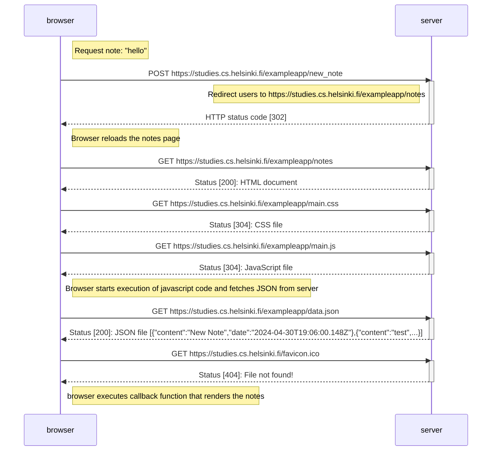

```mermaid
sequenceDiagram
    participant browser
    participant server

    Note right of browser: Request note: "hello" 
    browser->>server: POST https://studies.cs.helsinki.fi/exampleapp/new_note
    activate server
    Note left of server: Redirect users to https://studies.cs.helsinki.fi/exampleapp/notes
    server-->>browser: HTTP status code [302]
    deactivate server

    Note right of browser: Browser reloads the notes page

    browser->>server: GET https://studies.cs.helsinki.fi/exampleapp/notes
    activate server
    server-->>browser: Status [200]: HTML document
    deactivate server

    browser->>server: GET https://studies.cs.helsinki.fi/exampleapp/main.css
    activate server
    server-->>browser: Status [304]: CSS file
    deactivate server

    browser->>server: GET https://studies.cs.helsinki.fi/exampleapp/main.js
    activate server
    server-->>browser: Status [304]: JavaScript file
    deactivate server

    Note right of browser: Browser starts execution of javascript code and fetches JSON from server

    browser->>server: GET https://studies.cs.helsinki.fi/exampleapp/data.json
    activate server
    server-->>browser: Status [200]: JSON file [{"content":"New Note","date":"2024-04-30T19:06:00.148Z"},{"content":"test",...}]
    deactivate server

    browser->>server: GET https://studies.cs.helsinki.fi/favicon.ico
    activate server
    server-->>browser: Status [404]: File not found!
    deactivate server

    Note right of browser: browser executes callback function that renders the notes
```