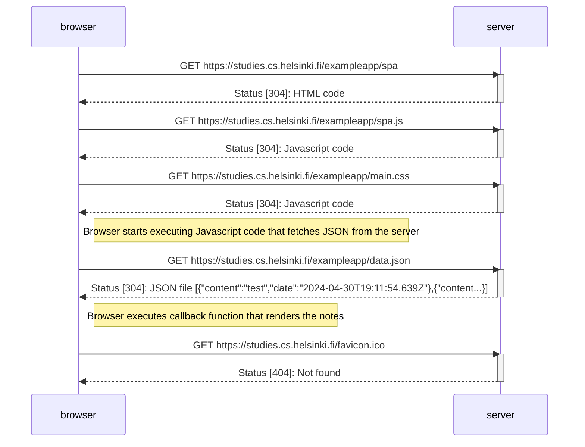

```mermaid
sequenceDiagram
    participant browser
    participant server

    browser->>server: GET https://studies.cs.helsinki.fi/exampleapp/spa
    activate server
    server-->>browser: Status [304]: HTML code
    deactivate server

    browser->>server: GET https://studies.cs.helsinki.fi/exampleapp/spa.js
    activate server
    server-->>browser: Status [304]: Javascript code
    deactivate server

    browser->>server: GET https://studies.cs.helsinki.fi/exampleapp/main.css
    activate server
    server-->>browser: Status [304]: Javascript code
    deactivate server

    Note right of browser: Browser starts executing Javascript code that fetches JSON from the server

    browser->>server: GET https://studies.cs.helsinki.fi/exampleapp/data.json
    activate server
    server-->>browser: Status [304]: JSON file [{"content":"test","date":"2024-04-30T19:11:54.639Z"},{"content...}]
    deactivate server

    Note right of browser: Browser executes callback function that renders the notes
    browser->>server: GET https://studies.cs.helsinki.fi/favicon.ico
    activate server
    server-->>browser: Status [404]: Not found
    deactivate server
```